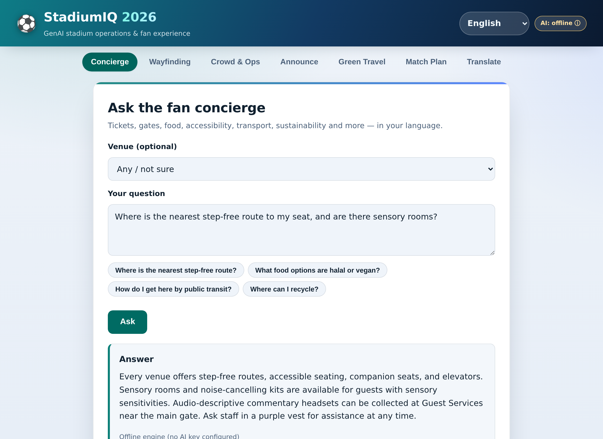
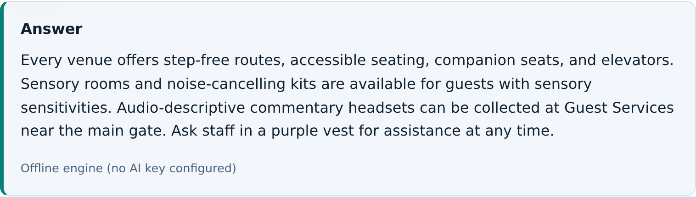
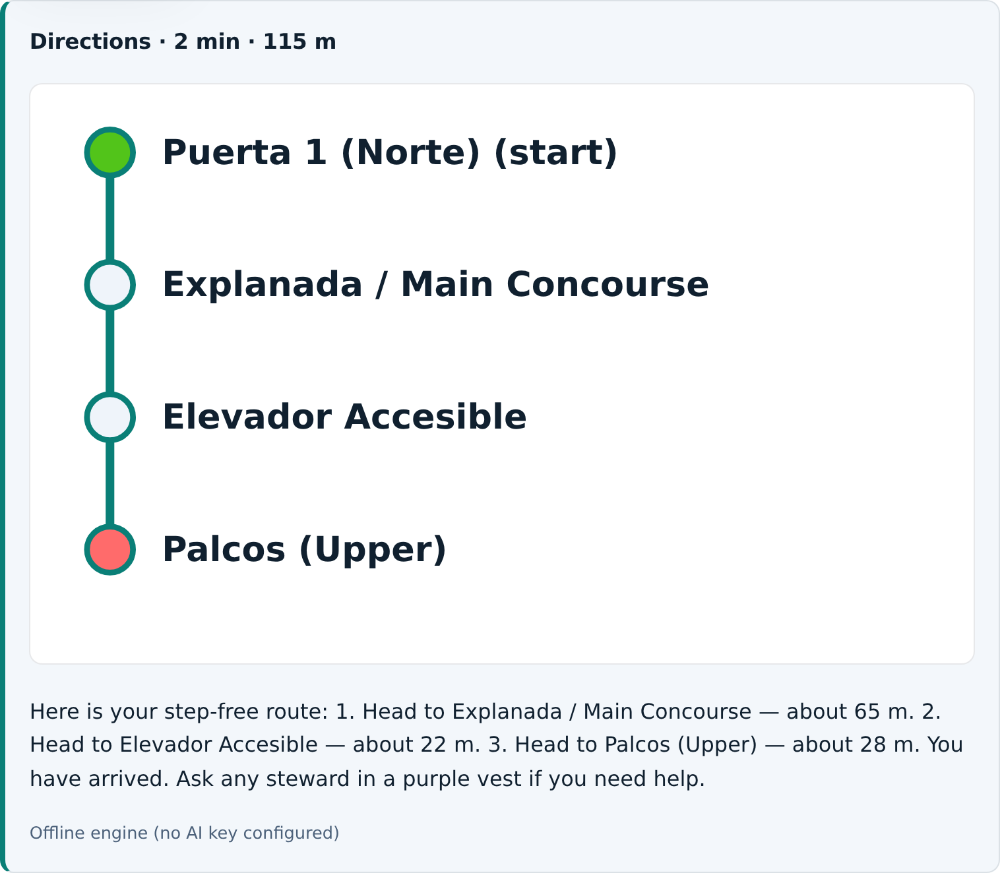
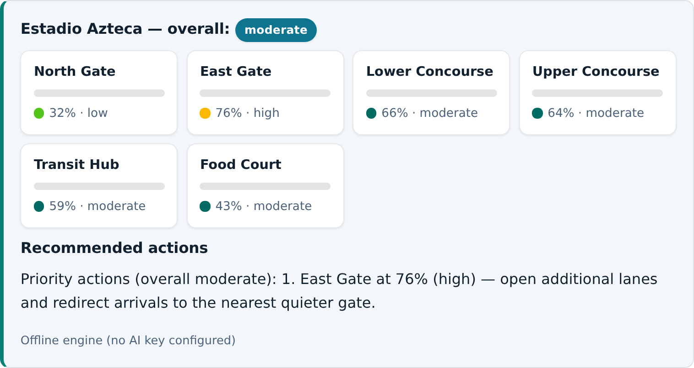
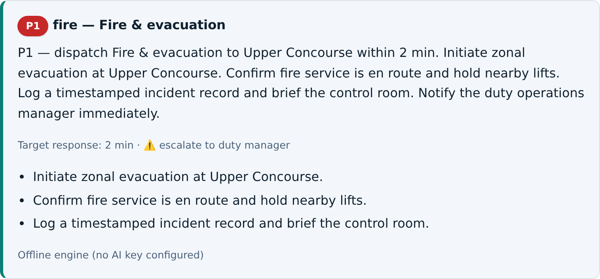
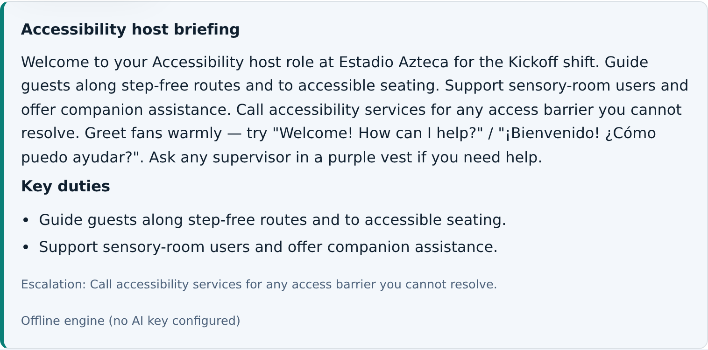
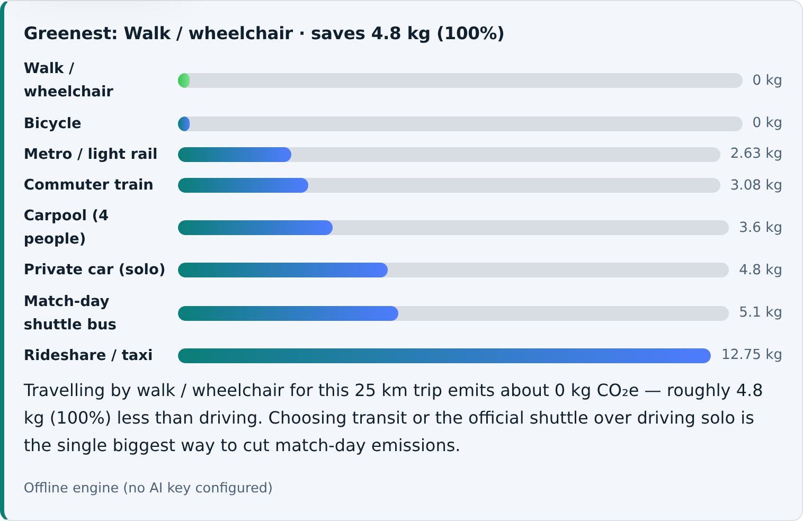
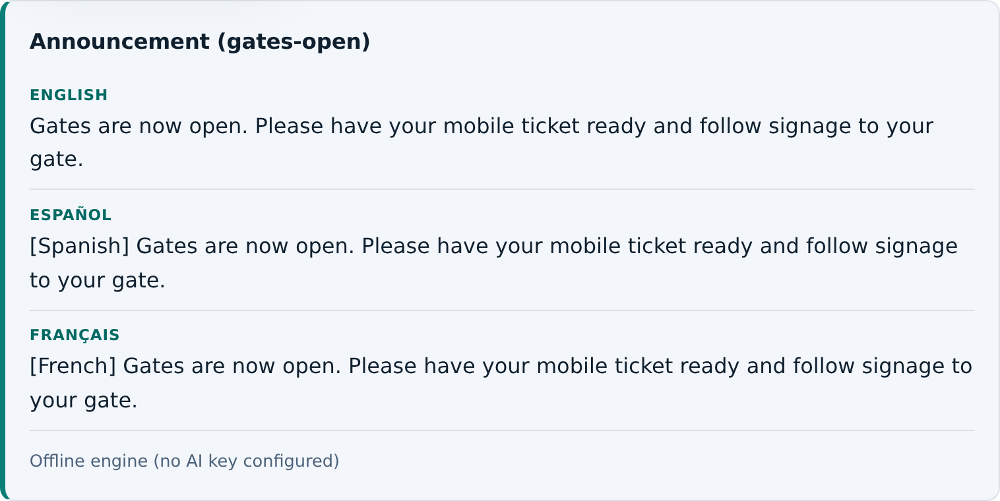
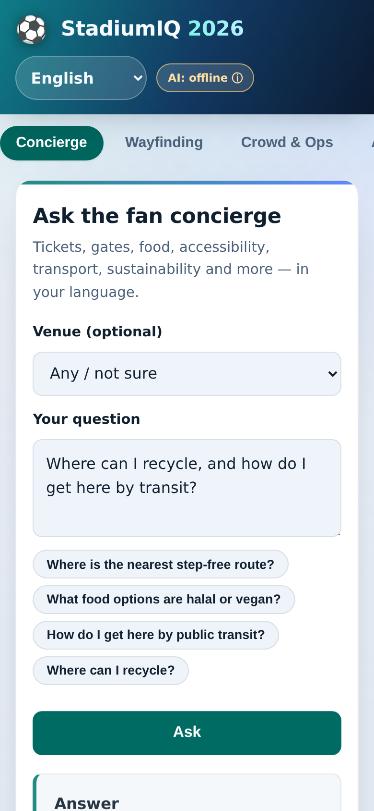

<div align="center">

# ⚽ StadiumIQ 2026

### GenAI Stadium Operations & Fan-Experience Platform for the FIFA World Cup 2026

_One always-available AI assistant for **fans, organizers, volunteers and venue staff** — across all 16 host stadiums in the USA, Canada & Mexico._

[](https://gen-gpee.onrender.com)


-blueviolet>)




</div>

---

> **⚡ Built to never hard-fail.** A tool for a live stadium must work even when the network doesn't. StadiumIQ uses **Anthropic Claude** when an API key is present, and **transparently falls back to a deterministic offline engine** otherwise — so **every feature, demo and test runs with zero external dependencies and zero cost.** The live demo above runs fully offline by design.

## 📑 Table of Contents

- [The Problem](#-the-problem)
- [Our Solution](#-our-solution)
- [Live Demo](#-live-demo)
- [Feature Showcase](#-feature-showcase)
- [Walkthrough](#-walkthrough)
- [How GenAI Is Used](#-how-genai-is-used)
- [Architecture](#-architecture)
- [Quick Start](#-quick-start)
- [API Reference](#-api-reference)
- [Quality, Testing & Security](#-quality-testing--security)
- [How We Meet Every Judging Criterion](#-how-we-meet-every-judging-criterion)
- [Deployment](#-deployment)
- [Project Structure](#-project-structure)
- [Documentation](#-documentation)
- [License](#-license)

## 🎯 The Problem

A **48-team, 104-match** World Cup across **3 countries and 16 venues** creates enormous operational load: fans who speak dozens of languages, unfamiliar stadiums, accessibility needs, crowd surges at gates and transit hubs, and staff & volunteers making second-by-second decisions. Information is scattered, monolingual, and reactive.

## 💡 Our Solution

StadiumIQ centralises it all into **one GenAI assistant** that turns Generative AI into practical, real-time help — implementing **every** capability area the challenge calls for, for **every** named audience.

<div align="center">

|                           For **Fans**                           |                  For **Organizers**                  |              For **Volunteers**              |                   For **Venue Staff**                   |
| :--------------------------------------------------------------: | :--------------------------------------------------: | :------------------------------------------: | :-----------------------------------------------------: |
| Concierge · Wayfinding · Green travel · Match plan · Translation | Crowd intelligence · Incident triage · Announcements | Shift briefings · Announcements · Wayfinding | Incident triage · Crowd ops · Briefings · Announcements |

</div>

## 🚀 Live Demo

**→ [https://stadiumiq-2026.onrender.com/](https://stadiumiq-2026.onrender.com)**

- The badge in the top-right reads **“AI: offline ⓘ”** — this is **intentional**: it runs the fully-functional offline engine (no API key needed). Hover it for details.
- ⏳ _Hosted on Render's free tier, which sleeps after ~15 min idle — the **first** load can take ~50s to wake. It's fast after that._

## ✨ Feature Showcase

Every capability area from the brief, implemented as a working, tested feature:

|  #  | Capability area                   | Feature                                                                  | Endpoint                             |
| :-: | --------------------------------- | ------------------------------------------------------------------------ | ------------------------------------ |
|  1  | 🗣️ **Multilingual assistance**    | RAG-grounded fan concierge in **10 languages** (RTL-aware)               | `POST /api/concierge`                |
|  2  | 🧭 **Navigation**                 | Shortest-path wayfinding + **step-free accessible mode** + SVG route map | `POST /api/navigate`                 |
|  3  | 👥 **Crowd management**           | Live per-zone density + AI-authored, prioritised actions                 | `GET /api/crowd/:venueId`            |
|  4  | ⚡ **Real-time decision support** | Incident triage: priority, dispatch team, response SLA, escalation       | `POST /api/incident`                 |
|  5  | 📢 **Operational intelligence**   | One-click **multilingual PA announcements**                              | `POST /api/announce`                 |
|  6  | 🦺 **Volunteer/staff enablement** | Role-specific **shift briefings** (duties, escalation, phrases)          | `POST /api/briefing`                 |
|  7  | 🌱 **Sustainability & transport** | Travel **carbon-footprint** comparison + greenest-choice nudge           | `POST /api/sustainability/footprint` |
|  8  | 🗓️ **Match-day planning**         | Personalised arrival plan from the fixture schedule                      | `GET /api/plan/:venueId`             |
|  9  | 🌐 **Translation**                | On-demand translation for staff & fans                                   | `POST /api/translate`                |
| ♿  | **Accessibility**                 | Accessible routing **and** a WCAG-2.1-AA, keyboard-navigable UI          | _cross-cutting_                      |

Coverage is even **machine-verifiable** at [`GET /api/capabilities`](https://stadiumiq-2026.onrender.com/api/capabilities) and asserted by tests. Full matrix → [`docs/ALIGNMENT.md`](docs/ALIGNMENT.md).

## 🎬 Walkthrough

_Real output from the live app, running on the offline engine (no API key)._

<table>
  <tr>
    <td width="50%" valign="top">
      <b>🗣️ Multilingual concierge</b><br/>
      <sub>Grounded, natural-language answers — here on accessibility & sensory rooms.</sub><br/>
      
    </td>
    <td width="50%" valign="top">
      <b>🧭 Accessible wayfinding</b><br/>
      <sub>Step-free route with an accessible SVG map — routed via the elevator, not stairs.</sub><br/>
      
    </td>
  </tr>
  <tr>
    <td width="50%" valign="top">
      <b>👥 Crowd & operational intelligence</b><br/>
      <sub>Live per-zone density with AI-authored, prioritised control-room actions.</sub><br/>
      
    </td>
    <td width="50%" valign="top">
      <b>⚡ Real-time incident triage</b><br/>
      <sub>Computed priority, dispatch team, response SLA and escalation + action brief.</sub><br/>
      
    </td>
  </tr>
  <tr>
    <td width="50%" valign="top">
      <b>🦺 Volunteer & staff briefing</b><br/>
      <sub>Role-specific shift briefing: duties, escalation path and welcome phrases.</sub><br/>
      
    </td>
    <td width="50%" valign="top">
      <b>🌱 Green travel & carbon footprint</b><br/>
      <sub>Ranked travel options with the greenest choice and the saving vs driving.</sub><br/>
      
    </td>
  </tr>
  <tr>
    <td colspan="2" valign="top">
      <b>📢 Multilingual PA announcements</b><br/>
      <sub>One message broadcast into many languages at once (RTL-aware).</sub><br/>
      
    </td>
  </tr>
  <tr>
    <td width="50%" valign="top" align="center">
      <b>📱 Responsive — mobile &amp; desktop</b><br/>
      
    </td>
    <td width="50%" valign="top">
      <b>🎨 Design &amp; accessibility</b><br/>
      <sub>
        Signature gradient app-bar, pill navigation that scrolls on small screens,
        elevated cards, 46px touch targets and smooth motion (reduced-motion aware).
        Light &amp; dark themes, high-contrast and forced-colors support — every
        screen <b>WCAG&nbsp;2.1&nbsp;AA verified by axe-core</b>.
      </sub>
    </td>
  </tr>
</table>

## 🧠 How GenAI Is Used

Every feature composes a **grounded prompt** and calls a **single AI gateway** — `aiService.generate({ system, prompt, fallback })`. The model is used where language _matters_ (friendly directions, calm incident briefs, encouraging sustainability nudges, multilingual announcements), while deterministic logic (routing, priority matrices, footprint maths) stays auditable.

Centralising the model behind one gateway means one place enforces **provider isolation, hard timeouts, prompt-injection sanitisation, response caching, usage metrics, and graceful offline fallback** — so the platform degrades safely instead of failing.

## 🏗️ Architecture

```
Browser (accessible SPA · vanilla JS · inline SVG route map · no framework)
        │  fetch /api/*
        ▼
Express app ─► requestId · timing · compression · helmet CSP · CORS
        │       · rate-limit (general + AI tier) · JSON guard · body caps · validation
        ├─ routes/     REST surface (+ OpenAPI, metrics, capabilities),
        │              cacheable reference data (ETag / 304)
        ├─ services/   one module per capability — pure, each with an offline fallback
        │      └─ aiService ──► ANTHROPIC_API_KEY?  yes → Claude (sanitised, cached)
        │                                            no/err → deterministic engine
        ├─ middleware/ validation · requestId · timing · security · error handling
        ├─ utils/      logger · TTL cache · prompt sanitiser
        └─ data/       venues · wayfinding graphs · KB · fixtures · emissions · capabilities
```

Details → [`docs/ARCHITECTURE.md`](docs/ARCHITECTURE.md).

## ⚡ Quick Start

```bash
# 1. Install (runtime deps only)
npm install

# 2. Run — works immediately with no API key (offline engine)
npm start                 # → http://localhost:3000

# 3. (Optional) enable live Claude
cp .env.example .env && echo "ANTHROPIC_API_KEY=sk-ant-..." >> .env

# 4. Test everything (browserless, no key, no network)
npm test                  # 119 tests
```

**Docker:**

```bash
docker build -t stadiumiq .
docker run -p 3000:3000 -e NODE_ENV=production stadiumiq
```

## 🔌 API Reference

<div align="center">

| Method | Endpoint                                           | Purpose                                         |
| ------ | -------------------------------------------------- | ----------------------------------------------- |
| `GET`  | `/api/health`                                      | Liveness + current AI mode                      |
| `GET`  | `/api/metrics`                                     | AI + route-cache hit-rates, avg latency, memory |
| `GET`  | `/api/openapi.json`                                | OpenAPI 3.1 contract                            |
| `GET`  | `/api/capabilities`                                | Capability → area → persona alignment map       |
| `GET`  | `/api/tournament` · `/api/config/options`          | Metadata & UI enums                             |
| `GET`  | `/api/venues` · `/api/venues/:id` · `/api/matches` | Reference data                                  |
| `POST` | `/api/concierge`                                   | Multilingual Q&A                                |
| `POST` | `/api/navigate`                                    | Wayfinding (with `accessibleOnly`)              |
| `GET`  | `/api/crowd/:venueId`                              | Crowd / ops snapshot                            |
| `POST` | `/api/incident`                                    | Real-time incident triage                       |
| `POST` | `/api/announce`                                    | Multilingual PA announcement                    |
| `POST` | `/api/briefing`                                    | Volunteer & staff shift briefing                |
| `POST` | `/api/sustainability/footprint`                    | Travel carbon comparison                        |
| `GET`  | `/api/plan/:venueId`                               | AI match-day plan                               |
| `POST` | `/api/translate`                                   | Translate text                                  |

</div>

```bash
curl -X POST https://stadiumiq-2026.onrender.com/api/incident \
  -H 'content-type: application/json' \
  -d '{"venueId":"usa-metlife","type":"crowd-surge","severity":"high","zone":"East Gate"}'
```

## 🧪 Quality, Testing & Security

```bash
npm run check       # eslint + prettier --check + 119 unit/integration tests
npm run test:e2e    # real-browser E2E + axe-core accessibility (light + dark)
npm run bench       # hot-path throughput micro-benchmark
```

- **119 unit + integration tests**, **~99% line coverage** — services, validators, middleware, the AI gateway's live path (via a stubbed `fetch`), route memoisation, and the full HTTP surface. All pass offline.
- **Browser E2E + axe-core** across all 8 panels: **0 WCAG 2.1 AA violations** in light **and** dark themes, **0 console errors**.
- **Security**: helmet CSP + HSTS + Permissions-Policy, CORS allow-list, two-tier rate limiting, bounded bodies (`413`), JSON content-type enforcement (`415`), typed input validation with error codes, prompt-injection sanitisation, no secrets committed. See [`SECURITY.md`](SECURITY.md).

## 🏆 How We Meet Every Judging Criterion

| Criterion                       | How StadiumIQ delivers                                                                                                                                                                                                  |
| ------------------------------- | ----------------------------------------------------------------------------------------------------------------------------------------------------------------------------------------------------------------------- |
| **Code Quality**                | Small single-responsibility modules · factory-built app · JSDoc throughout · consistent error model with machine-readable `code`s · OpenAPI 3.1 contract · **ESLint + Prettier clean**                                  |
| **Security**                    | Helmet CSP/HSTS/Permissions-Policy · CORS allow-list · 2-tier rate limiting · `413`/`415` guards · typed validation · **prompt-injection sanitisation** · request-id correlation · no prod stack-trace leakage          |
| **Efficiency**                  | **gzip (~79% smaller)** · ETag/`304` caching · **memoised Dijkstra (~30× faster warm)** · AI response cache · startup-indexed data · observable at `/api/metrics` + `npm run bench`                                     |
| **Testing**                     | **119 tests, ~99% coverage** · AI live-path stubbed · **axe-core E2E** in both themes (0 violations) · CI on Node 20 & 22                                                                                               |
| **Accessibility**               | Semantic HTML · ARIA Tabs + arrow keys · `aria-live`/`aria-busy` · per-result `lang`/`dir` · WCAG-AA contrast · reduced-motion / high-contrast / forced-colors · accessible SVG map · **first-class step-free routing** |
| **Problem Statement Alignment** | **All 8** capability areas **and all 4** named audiences covered — proven via `/api/capabilities` + tests · grounded in real 2026 data (16 venues, 48 teams, opening at Azteca, final at MetLife)                       |

## ☁️ Deployment

| Platform                             | Fit      |                                                                  |
| ------------------------------------ | -------- | ---------------------------------------------------------------- |
| **Render / Railway / Fly.io**        | ✅ Best  | `render.yaml` included — one-click blueprint                     |
| **Docker** (Cloud Run, ECS, K8s, VM) | ✅ Best  | `Dockerfile` (alpine, non-root, healthcheck)                     |
| **Vercel**                           | ⚠️ Works | Serverless adapter (`api/index.js` + `vercel.json`); see caveats |

**No database, no build step, no required secrets.** The only optional variable is `ANTHROPIC_API_KEY` (enables live AI). Full env-var reference & platform guides → [`docs/DEPLOY.md`](docs/DEPLOY.md).

## 📂 Project Structure

```
stadiumiq-2026/
├── src/
│   ├── app.js · server.js · config.js
│   ├── routes/        # API router, OpenAPI spec
│   ├── services/      # 9 GenAI features + AI gateway + knowledge base
│   ├── middleware/    # validation · security · timing · errors · requestId
│   ├── utils/         # logger · TTL cache · prompt sanitiser
│   └── data/          # venues · wayfinding · KB · fixtures · emissions · capabilities
├── public/            # accessible SPA (index.html · app.js · styles.css)
├── test/              # 119 unit + integration tests
├── e2e/               # browser E2E + axe-core accessibility
├── scripts/           # bench
├── docs/              # ARCHITECTURE · ALIGNMENT · ACCESSIBILITY · DEPLOY
├── Dockerfile · render.yaml · vercel.json · api/index.js
└── .github/workflows/ # CI (lint · format · test · audit · e2e)
```

## 📚 Documentation

| Doc                                                                   | What's inside                                                       |
| --------------------------------------------------------------------- | ------------------------------------------------------------------- |
| [`docs/DEPLOY.md`](docs/DEPLOY.md)                                    | Hosting options (Docker/Render/Vercel) & every environment variable |
| [`docs/ARCHITECTURE.md`](docs/ARCHITECTURE.md)                        | Layers, the AI gateway pattern, algorithms, efficiency              |
| [`docs/ALIGNMENT.md`](docs/ALIGNMENT.md)                              | Problem-statement coverage matrix (areas × personas)                |
| [`docs/ACCESSIBILITY.md`](docs/ACCESSIBILITY.md)                      | WCAG approach & automated axe-core checks                           |
| [`SECURITY.md`](SECURITY.md)                                          | Security controls & deployment hardening checklist                  |
| [`CONTRIBUTING.md`](CONTRIBUTING.md) · [`CHANGELOG.md`](CHANGELOG.md) | Dev workflow & release notes                                        |

## 📝 License

[MIT](LICENSE) — built for the **FIFA World Cup 2026** across 🇺🇸 🇨🇦 🇲🇽.

<div align="center">

**StadiumIQ 2026** — _navigation · crowd management · accessibility · transportation · sustainability · multilingual assistance · operational intelligence · real-time decision support._

Runs with or without a live AI model. Always on. Always accessible.

</div>
